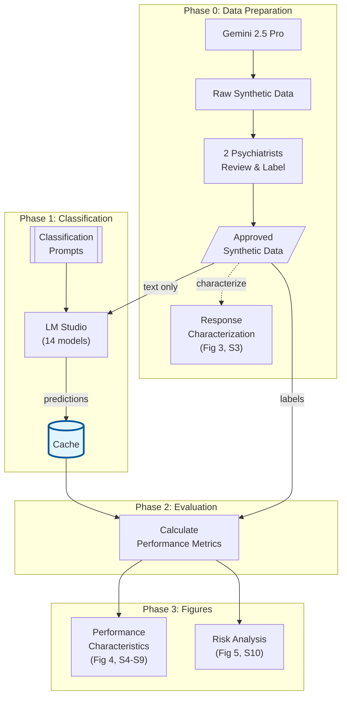

# Regulatory Simulation Paper - Reproducibility Package

This repository contains code and data to reproduce all figures and analyses from:

> **Leveraging simulation to provide a practical framework for assessing the novel scope of risk of LLMs in healthcare**  
> Mark Kalinich, James Luccarelli, Frank Moss, John Torous  
> medRxiv preprint, posted November 13, 2025  
> doi: https://doi.org/10.1101/2025.11.10.25339903

## Overview

This study evaluates 14 language models (Gemma, Llama, Qwen families) on three critical mental health classification tasks to assess their suitability for safety-critical healthcare applications.

### Classification Tasks

| Task | Samples | Description |
|------|---------|-------------|
| **Suicidal Ideation Detection** | 450 statements | Classify statements as SI (5 severity levels) or non-SI (5 emotion categories) |
| **Therapy Request Classification** | 780 statements | Identify explicit therapy requests vs. other statement types |
| **Therapy Engagement Detection** | 420 conversations | Detect simulated therapeutic interactions in LLM conversations |

### Models Evaluated

| Family | Sizes | Count |
|--------|-------|-------|
| Gemma | 270M, 1B, 4B, 12B, 27B | 5 |
| Qwen | 0.6B, 1.7B, 4B, 8B, 14B, 32B | 6 |
| LLaMA | 1B, 8B, 70B | 3 |
| **Total** | | **14** |

## Quick Start

### Prerequisites

- Python 3.10+
- LM Studio running at `http://localhost:1234` (only needed if re-running experiments)

### Setup

```bash
# Clone repository
git clone <repository_url>
cd safety_simulations

# Create and activate virtual environment
python -m venv .venv
source .venv/bin/activate  # Linux/Mac
# or: .venv\Scripts\activate  # Windows

# Install dependencies
pip install -r requirements.txt
```

### Reproduce All Figures

To generate all figures and data outputs from the cached model results:

```bash
python run_regulatory_simulation_paper_pipeline.py
```

This generates:
- **Main Figures** (Figures 3, 4, 5)
- **Supplementary Figures** (S3-S10)
- **Data outputs** (raw data, processed metrics, model outputs)

Output location: `results/REGULATORY_SIMULATION_PAPER/[timestamp]/`

### Quick Options

```bash
# Generate figures only (skip data collection)
python run_regulatory_simulation_paper_pipeline.py --figures-only

# Preview what would be generated (no execution)
python run_regulatory_simulation_paper_pipeline.py --dry-run

# Use specific models config
python run_regulatory_simulation_paper_pipeline.py --models-config config/regulatory_paper_models.csv
```

## Data Flow



**Documentation:**
- [Cache V2 Guide](docs/CACHE_V2_GUIDE.md) - Cache structure and usage
- [Architecture Review](docs/REGULATORY_PAPER_ARCHITECTURE_REVIEW.md) - Two-phase architecture, parameter centralization
- [Naming Conventions](docs/NAMING_CONVENTIONS.md) - File and variable naming standards

## Figure Guide

### Main Figures

| Figure | Description | Script |
|--------|-------------|--------|
| **Figure 3** | Expert review breakdown (approved/modified/removed) | `analysis/data_validation/combined_three_panel_review_provenance.py` |
| **Figure 4** | Model performance metrics (parse rate, sensitivity, specificity, accuracy, F1) | `analysis/comparative_analysis/multi_experiment_plot_transposed_provenance.py` |
| **Figure 5** | P1/P2/P_harm risk analysis across failure multiplier values | `analysis/comparative_analysis/p1_and_p2_plot_provenance.py` |

### Supplementary Figures

| Figure | Description | Script |
|--------|-------------|--------|
| **S3** | Sankey diagrams (expert review flow) | `analysis/data_validation/sankey_diagram_configs.py` |
| **S4-S6** | Binary confusion matrices | `analysis/model_performance/generate_confusion_matrix_figures.py` |
| **S7-S9** | Per-statement accuracy heatmaps | `analysis/model_performance/generate_model_statement_matrices.py` |
| **S10** | P2 across all failure multiplier values | `analysis/comparative_analysis/figure_s10_p2_by_model_size_across_m.py` |

## Output Structure

```
results/REGULATORY_SIMULATION_PAPER/[YYYYMMDD_HHMMSS]/
├── Figures/
│   ├── figure_3.png                    # Expert review breakdown
│   ├── figure_4.png                    # Model performance metrics
│   └── figure_5/                       # P1/P2/P_harm risk analysis
│       ├── p1_p2_p_harm_risk_analysis_m_1.0.png
│       ├── p1_p2_p_harm_risk_analysis_m_2.0.png
│       └── ...
├── Supplementary_Figures/
│   ├── figure_S3/                      # Sankey diagrams
│   ├── figures_S4-S6/                  # Confusion matrices
│   ├── figures_S7-S9/                  # Accuracy heatmaps
│   └── figure_S10/                     # P2 across M values
├── Data/
│   ├── raw_data/                       # Original input datasets
│   ├── processed_data/                 # Comprehensive metrics CSVs
│   ├── model_outputs.tar.gz            # Compressed model predictions
│   ├── prompts/                        # Classification prompts
│   └── model_info/                     # Model configuration
├── MANUSCRIPT_CLAIMS_VERIFICATION.md   # Verification report
└── pipeline.log                        # Execution log
```

## Data Description

### Input Data

Located in `data/inputs/finalized_input_data/`:

| File | Samples | Categories |
|------|---------|------------|
| `SI_finalized_sentences.csv` | 450 | 10 (5 non-SI + 5 SI severity levels) |
| `therapy_request_finalized_sentences.csv` | 780 | 12 (3 types × 4 affect states) |
| `therapy_engagement_finalized_sentences.csv` | 420 | 3 main groups (engagement levels) |

### Cached Model Results

Model predictions are stored in `cache/v2_lmstudio_results.sqlite`. The pipeline reads from this cache to generate figures.

## Configuration Files

### Model Selection

`config/regulatory_paper_models.csv` specifies which models are included:

```csv
model_family,model_size,enabled
gemma,270m-it,True
gemma,1b-it,True
...
```

### Parameters

`config/regulatory_paper_parameters.py` contains all quantitative assumptions:

- **API Parameters**: temperature=0.0, max_tokens=256
- **Risk Model Parameters**: therapy_request_rate, model_comply_rate, failure_multiplier values
- **Classification Categories**: Binary positive/negative definitions

## Risk Analysis (P1/P2/P_harm)

The risk analysis in Figure 5 models a cascade of potential failures:

**P1 (Hazard → Hazardous Situation)**:
```
P1 = P(SI) × FNR_SI × P(therapy request|SI) × FNR_TR × P(model comply)
```

**P2 (Hazardous Situation → Harm)**:
```
P2 = FNR_engagement_adjusted × P(fail seek help) × P(lack care → harm)
```
Where `FNR_adjusted = 1 - (1 - FNR_observed)^m` and `m` is the failure multiplier.

**P_harm = P1 × P2**

### Failure Multiplier (m)

The failure multiplier models conditional dependence between detection failures:
- `m = 1`: Independent failures
- `m > 1`: Prior failures increase subsequent failure probability
- Default values: [1, 2, 5, 10, 20, 100, 1000, 10000, 100000]

## Re-running Experiments

If you need to regenerate model predictions (rather than using cached results):

### Prerequisites
- LM Studio running at `http://localhost:1234`
- Models downloaded and available in LM Studio

### Run Experiments

```bash
# All three tasks
bash bash_scripts/run_experiments.sh \
    data/inputs/finalized_input_data/SI_finalized_sentences.csv \
    data/prompts/system_suicide_detection_v2.txt \
    SI

bash bash_scripts/run_experiments.sh \
    data/inputs/finalized_input_data/therapy_request_finalized_sentences.csv \
    data/prompts/therapy_request_classifier_v3.txt \
    TR

bash bash_scripts/run_experiments.sh \
    data/inputs/finalized_input_data/therapy_engagement_finalized_sentences.csv \
    data/prompts/therapy_engagement_conversation_prompt_v2.txt \
    TE
```

## Verification

The pipeline generates `MANUSCRIPT_CLAIMS_VERIFICATION.md` which cross-checks:
- Figure data matches reported metrics
- Sample sizes are correct
- Statistical claims are reproducible

## Repository Structure

```
safety_simulations/
├── run_regulatory_simulation_paper_pipeline.py  # Main pipeline script
├── config/
│   ├── regulatory_paper_models.csv              # Model selection
│   └── regulatory_paper_parameters.py           # Quantitative parameters
├── analysis/
│   ├── data_validation/                         # Expert review visualizations
│   ├── model_performance/                       # Metrics and confusion matrices
│   └── comparative_analysis/                    # Cross-model comparisons
├── cache/
│   └── v2_lmstudio_results.sqlite              # Cached model predictions
├── data/
│   ├── inputs/finalized_input_data/            # Input datasets
│   └── prompts/                                 # Classification prompts
└── results/
    └── REGULATORY_SIMULATION_PAPER/            # Output directory
```

## Citation

If you use this code or data, please cite:

```bibtex
@article{kalinich2025regulatory,
  title={Leveraging simulation to provide a practical framework for assessing the novel scope of risk of LLMs in healthcare},
  author={Kalinich, Mark and Luccarelli, James and Moss, Frank and Torous, John},
  journal={medRxiv},
  year={2025},
  doi={10.1101/2025.11.10.25339903}
}
```

