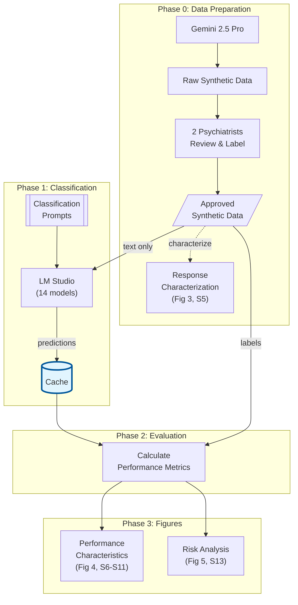

# Regulatory Simulation Paper - Reproducibility Package


This repository contains code and data to reproduce all figures and analyses from:

> **Leveraging simulation to provide a practical framework for assessing the novel scope of risk of LLMs in healthcare**  
> Mark Kalinich, James Luccarelli, Frank Moss, John Torous  
> medRxiv preprint, posted November 13, 2025  
> doi: https://doi.org/10.1101/2025.11.10.25339903

## Background

Large language models (LLMs) are rapidly entering clinical care, yet their definitionally probabilistic outputs have delivered a variety of grossly unsafe responses to users. The difficulty in quantifying and mitigating the novel risks posed by LLMs threatens to stall the regulatory evaluation and clinical deployment of LLM-based software as a medical device (LLM-SaMD). A practical, evidence-based framework is urgently needed for extending existing medical-device regulations to encompass LLM-SaMDs. Using synthetic interactions between a chatbot and a potentially suicidal user, we demonstrate a simulation-based framework that provides a reproducible and generalizable method for evaluating the novel risks of LLM-SaMDs.

## Methods 
We developed a framework integrating LLM performance testing into SaMD risk estimation. Fourteen open-source models ranging from 270 million to 70 billion parameters (Qwen, Gemma, and LLaMA families) were evaluated on three safety-classification tasks: suicidal-ideation detection, therapy-request detection, and therapy-like interaction detection. Synthetic datasets were generated by Gemini 2.5 Pro and verified by psychiatrists. Model false-negative rates informed probabilistic estimates of P1, the likelihood of a hazard progressing to a hazardous situation, and P2, the likelihood of that situation resulting in harm.

### Classification Tasks

| Task | Samples | Description |
|------|---------|-------------|
| **Suicidal Ideation Detection** | 450 statements | Classify statements as SI (5 severity levels) or non-SI (5 emotion categories) |
| **Therapy Request Classification** | 780 statements | Identify explicit therapy requests vs. other statement types |
| **Therapy Engagement Detection** | 420 conversations | Detect simulated therapeutic interactions in LLM conversations |

### Models Evaluated

| Family | Sizes | Count |
|--------|-------|-------|
| Gemma | 270M, 1B, 4B, 12B, 27B | 5 |
| Qwen | 0.6B, 1.7B, 4B, 8B, 14B, 32B | 6 |
| LLaMA | 1B, 8B, 70B | 3 |
| **Total** | | **14** |

## Quick Start

### Prerequisites

- Python 3.10+
- LM Studio running at `http://localhost:1234` (only needed if re-running experiments)

### Setup

```bash
# Clone repository
git clone https://github.com/markkalinich/regulatory_simulations.git
cd regulatory_simulations

# Create and activate virtual environment
python -m venv .venv
source .venv/bin/activate  # Linux/Mac
# or: .venv\Scripts\activate  # Windows

# Install dependencies
pip install -r requirements.txt
```

### Reproduce All Figures

To generate all figures and data outputs from the cached model results:

```bash
python run_regulatory_simulation_paper_pipeline.py
```

This generates:
- **Main Figures** (Figures 3, 4, 5)
- **Supplementary Figures** (manuscript **S5–S13**; see Figure Guide — some pipeline folders use older numeric names)
- **Supplementary Tables S1–S3** → `Data/processed_data/supplementary_tables/` (`analysis/generate_supplementary_tables.py`)
- **Data outputs** (raw data, processed metrics, model outputs)
- **Logs** (pipeline log, manuscript claims verification, figure provenance, audits)
Output location: `results/REGULATORY_SIMULATION_PAPER/[timestamp]/`

### Quick Options

```bash
# Generate figures only (skip data collection)
python run_regulatory_simulation_paper_pipeline.py --figures-only

# Preview what would be generated (no execution)
python run_regulatory_simulation_paper_pipeline.py --dry-run

# Use specific models config
python run_regulatory_simulation_paper_pipeline.py --models-config config/regulatory_paper_models.csv
```

## Data Flow


```mermaid
flowchart TB
    subgraph P0[Phase 0: Data Preparation]
        gemini["Gemini 2.5 Pro"] --> raw[Raw Synthetic Data]
        raw --> psych["2 Psychiatrists<br>Review & Label"]
        psych --> data[/"Approved<br>Synthetic Data"/]
        data -.->|characterize| char["Response<br>Characterization<br>(Fig 3, S5)"]
    end
    
    subgraph P1[Phase 1: Classification]
        data -->|text only| lms["LM Studio<br>(14 models)"]
        prompts[["Classification<br>Prompts"]] --> lms
        lms -->|predictions| cache[("Cache")]
    end
    
    subgraph P2[Phase 2: Evaluation]
        cache --> metrics["Calculate<br>Performance Metrics"]
        data -->|labels| metrics
    end
    
    subgraph P3[Phase 3: Figures]
        metrics --> perf["Performance<br>Characteristics<br>(Fig 4, S6-S11)"]
        metrics --> risk["Risk Analysis<br>(Fig 5, S13)"]
    end
    
    style cache fill:#e1f5fe,stroke:#01579b,stroke-width:3px
```

**Documentation:**
- [Cache V3 Guide](docs/cache_v3_guide.md) - Cache structure and usage
- [Naming Conventions](docs/naming_conventions.md) - File and variable naming standards

## Figure Guide

### Main Figures

| Figure | Description | Script |
|--------|-------------|--------|
| **Figure 3** | Expert review breakdown (approved/modified/removed) | `analysis/data_validation/combined_three_panel_review_provenance.py` |
| **Figure 4** | Model performance metrics (parse rate, sensitivity, specificity, accuracy, F1) | `analysis/comparative_analysis/multi_experiment_plot_transposed_provenance.py` |
| **Figure 5** | P1/P2/P_harm risk analysis across failure multiplier values | `analysis/comparative_analysis/p1_and_p2_plot_provenance.py` |

### Supplementary Figures

Manuscript numbering is **S5–S13**. Output folder names are historical (`figure_S4`, `figures_S5-S7`, …) and are listed so you can find files in `results/…/Supplementary_Figures/`.

| Manuscript | Description | Pipeline output | Script |
|------------|-------------|-----------------|--------|
| **S5** | Sankey diagrams (expert review flow) | `figure_S4/` | `analysis/data_validation/sankey_diagram_configs.py` |
| **S6–S8** | Binary confusion matrices (SI, therapy request, therapy engagement) | `figures_S5-S7/` | `analysis/model_performance/generate_confusion_matrix_figures.py` |
| **S9–S11** | Per-statement accuracy heatmaps (SI, therapy request, therapy engagement) | `figures_S8-S10/` | `analysis/model_performance/generate_model_statement_matrices.py` |
| **S12** | Adjusted FNR vs observed FNR and failure multiplier *M* (heatmap) | `figure_S12/` | `analysis/revisions/figure_s12_failure_multiplier_heatmap.py` |
| **S13** | P2 across failure-multiplier (*M*) values (correlated failure / harm prevalence) | `figure_S11/` | `analysis/comparative_analysis/figure_s11_p2_by_model_size_across_m.py` |

## Output Structure

```
results/REGULATORY_SIMULATION_PAPER/[YYYYMMDD_HHMMSS]/
├── README.md                           # Directory structure guide
├── Figures/
│   ├── figure_3.png                    # Psychiatrist review breakdown
│   ├── figure_4.png                    # Model performance metrics
│   └── figure_5/                       # P1/P2 risk analysis 
├── Supplementary_Figures/
│   ├── figure_S4/                      # Manuscript **S5**: Sankey diagrams
│   ├── figures_S5-S7/                  # Manuscript **S6–S8**: Confusion matrices
│   ├── figures_S8-S10/                 # Manuscript **S9–S11**: Per-statement accuracy heatmaps
│   ├── figure_S11/                     # Manuscript **S13**: P2 across *M* values
│   └── figure_S12/                     # Manuscript **S12**: FNR adjustment vs *M* heatmap
├── Data/
│   ├── raw_data/
│   │   ├── model_info/                 # paper_models_config.csv + manifest.json
│   │   ├── model_inputs/
│   │   │   ├── prompts/                # Classification prompts
│   │   │   ├── statements/             # Statements models evaluated
│   │   │   └── table_s7_parameters.csv # parameters used in modeling
│   │   └── model_outputs/              # Per-statement model outputs
│   └── processed_data/
│       ├── correlated_failure_analysis/
│       ├── difficult_statement_analysis/
│       ├── model_performance_metrics/
│       ├── psychiatrist_statement_review/
│       └── supplementary_tables/        # S1–S3 CSVs
└── Logs/
    ├── pipeline.log
    ├── manuscript_claims_verification.md # calculate every numerical claim in our paper from cache 
    ├── figure_provenance/              # Figure + audit provenance JSONs
    └── Audits/                         # Audit reports (orthogonal calculations to verify key claims)
```

## Data Description

### Input Data

Located in `data/inputs/finalized_input_data/`:

| File | Samples | Categories |
|------|---------|------------|
| `SI_finalized_sentences.csv` | 450 | 10 (5 non-SI + 5 SI severity levels) |
| `therapy_request_finalized_sentences.csv` | 780 | 12 (3 types × 4 affect states) |
| `therapy_engagement_finalized_sentences.csv` | 420 | 3 main groups (engagement levels) |

### Cached Model Results

Model predictions are stored in `regulatory_paper_cache_v3/results.db`. The pipeline reads from this cache to generate figures.

## Configuration Files

### Model Selection

`config/regulatory_paper_models.csv` specifies which models are included:

```csv
family,size,version,lm_studio_id,...,enabled
gemma,270m-it,3.0,google.gemma-3-270m-it,...,True
gemma,1b-it,3.0,google.gemma-3-1b-it,...,True
...
```

### Parameters

`config/regulatory_paper_parameters.py` contains all quantitative assumptions:

- **API Parameters**: temperature=0.0, max_tokens=256
- **Risk Model Parameters**: therapy_request_rate, model_comply_rate, failure_multiplier values
- **Classification Categories**: Binary positive/negative definitions

## Risk Analysis (P1/P2/P_harm)

The risk analysis in Figure 5 models a cascade of potential failures:

**P1 (Hazard → Hazardous Situation)**:
```
P1 = P(SI) × FNR_SI × P(therapy request|SI) × FNR_TR × P(model comply)
```

**P2 (Hazardous Situation → Harm)**:
```
P2 = FNR_engagement_adjusted × P(fail seek help) × P(lack care → harm)
```
Where `FNR_adjusted = 1 - (1 - FNR_observed)^m` and `m` is the failure multiplier.

**P_harm = P1 × P2**

### Failure Multiplier (m)

The failure multiplier models conditional dependence between detection failures:
- `m = 1`: Independent failures
- `m > 1`: Prior failures increase subsequent failure probability
- Default values: [1, 2, 5, 10, 100, 1000, 10000, 100000]

## Cache and Experiment Execution

We provide a pre-built cache (`regulatory_paper_cache_v3/results.db`) so you can reproduce figures without re-running experiments.

### Generating Cache from Scratch

To regenerate the cache, use `bash_scripts/run_all_models.sh` for each task:

```bash
# Run for each of the 3 tasks (requires LM Studio + all 14 models)
./bash_scripts/run_all_models.sh \
    data/inputs/finalized_input_data/SI_finalized_sentences.csv \
    data/prompts/system_suicide_detection_v2.txt \
    system_suicide_detection_v2

./bash_scripts/run_all_models.sh \
    data/inputs/finalized_input_data/therapy_request_finalized_sentences.csv \
    data/prompts/therapy_request_classifier_v3.txt \
    therapy_request_classifier_v3

./bash_scripts/run_all_models.sh \
    data/inputs/finalized_input_data/therapy_engagement_finalized_sentences.csv \
    data/prompts/therapy_engagement_conversation_prompt_v2.txt \
    therapy_engagement_conversation_prompt_v2
```

### Using the Provided Cache

```bash
# Full pipeline (figures + data + audits)
python run_regulatory_simulation_paper_pipeline.py

# Figures only (faster)
python run_regulatory_simulation_paper_pipeline.py --figures-only

# Preview without execution
python run_regulatory_simulation_paper_pipeline.py --dry-run
```

## Verification

The pipeline recalculates/rechecks key claims:

1. **Manuscript Claims Verification** - Compares generated data against `config/manuscript_claims.json`
2. **Figure Audits** - Independently recalculates values from cache and compares to outputs:
   - Confusion matrix audit (Figure 4 plus manuscript **S6–S8**; output `figures_S5-S7/`)
   - Heatmap audit (manuscript **S9–S11**; output `figures_S8-S10/`)
   - P2-across-*M* audit (manuscript **S13**; output `figure_S11/`)
3. **Cache Audit** - Verifies cache integrity and parameter consistency

**Output**: `Logs/manuscript_claims_verification.md`, `Logs/Audits/`, `Logs/figure_provenance/`

## Repository Structure

```
regulatory_simulations/
├── run_regulatory_simulation_paper_pipeline.py  # Main pipeline script
├── config/
│   ├── regulatory_paper_models.csv              # Model selection
│   └── regulatory_paper_parameters.py           # Quantitative parameters
├── analysis/
│   ├── data_validation/                         # Expert review visualizations
│   ├── model_performance/                       # Metrics and confusion matrices
│   └── comparative_analysis/                    # Cross-model comparisons
├── utilities/
│   ├── confusion_matrix_audit.py                # Fig 4 + manuscript S6–S8 audit
│   ├── heatmap_audit.py                         # Manuscript S9–S11 audit
│   └── figure_s11_audit.py                      # Manuscript S13 (output folder figure_S11) audit
├── regulatory_paper_cache_v3/
│   └── results.db                               # Cached model predictions
├── data/
│   ├── inputs/finalized_input_data/            # Input datasets
│   └── prompts/                                 # Classification prompts
└── results/
    └── REGULATORY_SIMULATION_PAPER/            # Output directory
```

## Citation

If you use this code or data, please cite:

```bibtex
@article{kalinich2025regulatory,
  title={Leveraging simulation to provide a practical framework for assessing the novel scope of risk of LLMs in healthcare},
  author={Kalinich, Mark and Luccarelli, James and Moss, Frank and Torous, John},
  journal={medRxiv},
  year={2025},
  doi={10.1101/2025.11.10.25339903}
}
```

---

## TODO (defer until final pass)

### Figure guide ↔ pipeline output names

The [Figure Guide](#figure-guide) uses **manuscript supplementary numbering (S5–S13)** and maps each figure to **historical pipeline folder names** (e.g. manuscript S5 → `figure_S4/`, manuscript S13 → `figure_S11/`). That mismatch is intentional for now to avoid churn in the pipeline, audits, and provenance.

**Planned:** After reviewer revisions are complete, perform **one surgical change set** that renames outputs, paths, and references in code so **folder and file names match the manuscript figure numbers**, then **freeze** the release (tag / resubmission bundle). Until then, treat renames as out of scope and rely on the Figure Guide table for the mapping.

