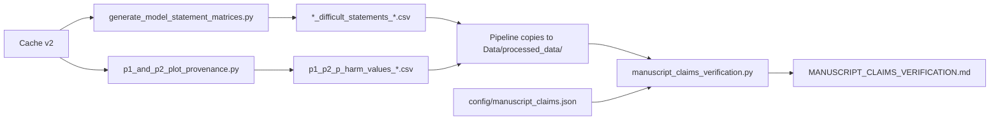

# Manuscript Claims Verification - System Guide

**Created:** 2026-01-19  
**Purpose:** Document the automated manuscript claims verification system and key learnings

---

## Overview

This system provides automated verification that all numerical claims in the manuscript match the actual pipeline output. 

### Key Components

1. **Claims Registry**: `config/manuscript_claims.json` - Single source of truth for all manuscript numbers
2. **Verification Script**: `analysis/manuscript_claims_verification.py` - Compares claims against pipeline output
3. **Pipeline Integration**: `run_regulatory_simulation_paper_pipeline.py` - Runs verification as final step
4. **Generated Statistics**: Intermediate CSVs for reproducibility

---

## The Claims Registry (`config/manuscript_claims.json`)

### Structure

```json
{
  "_metadata": {
    "description": "...",
    "last_updated": "2026-01-19",
    "manuscript_version": "v2_revision",
    "notes": "All claims verified against GGUF/Monte Carlo pipeline output"
  },
  
  "section_1_gemini_data": {
    "description": "Gemini-generated synthetic data (Figure 3)",
    "claims": {
      "non_si_retained": {
        "value": "481/500",
        "numerator": 481,
        "denominator": 500,
        "context": "Non-suicidal statements retained"
      },
      // ... more claims
    }
  },
  
  "section_2_cross_model_performance": { /* ... */ },
  "section_3_p1_p2_estimates": { /* ... */ },
  "abstract": { /* ... */ },
  
  "_removed_claims": {
    "qwen_8b_vs_4b_nonmonotonic": {
      "original_claim": "Qwen 8B P1=1.04×10⁻⁵ nearly 15x worse than 4B",
      "reason": "Artifact of MLX format issues, not reproduced with GGUF",
      "removed_in": "v2_revision"
    }
  }
}
```

### When to Update

Update `manuscript_claims.json` when:
- Manuscript numerical values change
- New claims are added
- Claims are removed (move to `_removed_claims` section)
- Baseline assumptions change (e.g., prevalence percentages)

**DO NOT** update based on minor Monte Carlo variations (<5%). The verification script has built-in tolerances.

---

## Verification Workflow

### Automatic Verification (Recommended)

The pipeline automatically runs verification as its final step:

```bash
python run_regulatory_simulation_paper_pipeline.py --cache-dir cache_v2
```

Output: `results/REGULATORY_SIMULATION_PAPER/[timestamp]/MANUSCRIPT_CLAIMS_VERIFICATION.md`

### Manual Verification

```bash
python analysis/manuscript_claims_verification.py \
    --paper-run-dir results/REGULATORY_SIMULATION_PAPER/20260119_001315
```

### Verification Report Format

```markdown
# Manuscript Claims Verification

## Section 1: Gemini-Generated Synthetic Data (Figure 3)

✅ PASSED
Claim: Non-SI statements retained 481/500
Data: 481/500

❌ FAILED
Claim: SI detection: 22 statements (4.9%) missed
Data: 21 statements (4.7%)
```

---

## Data Dependencies

### Input Files Required

The verification script reads from:

1. **Review Statistics** (`results/review_statistics/`):
   - `si_review_statistics.csv`
   - `therapy_request_review_statistics.csv`
   - `therapy_engagement_review_statistics.csv`
   - `chi_squared_tests.csv`

2. **Difficult Statements** (generated by `generate_model_statement_matrices.py`):
   - `*_difficult_statements_summary.csv`
   - `*_difficult_statements_breakdown.csv`

3. **Model Performance Matrices** (`results/review_statistics/`):
   - `*_model_statement_correctness_matrix.csv`
   - `*_statement_info.csv`

4. **P1/P2 Risk Data** (generated by `p1_and_p2_plot_provenance.py`):
   - `p1_p2_p_harm_values_m_1.0.csv`
   - `p1_p2_p_harm_values_m_100000.0.csv` (for strong dependence checks)

### How Data is Generated



---

## Critical Learnings

### 1. MLX vs GGUF Model Formats

**Issue Discovered:** Original paper used mixed MLX and GGUF models, leading to inconsistent performance.

**Key Findings:**
- **Qwen 8B**: Dramatically different performance between MLX and GGUF
  - MLX 4-bit: Poor parse rates, low sensitivity → P1 = 1.04×10⁻⁵
  - GGUF 4-bit: Excellent performance → P1 = 0 (perfect TR sensitivity)
- **Gemma 27B**: Improved from 4-bit GGUF to 8-bit GGUF
- **Impact**: Changed P1 range, P2 range, and invalidated Qwen 8B vs 4B non-monotonic scaling claim

**Resolution:** 
- Switched to GGUF-only for all models (cache_v2)
- Updated all manuscript claims
- Removed Qwen 8B vs 4B comparison from manuscript
- Added author's note explaining revision

**Documentation**: This finding emphasized the importance of:
- Consistent model formats across all experiments
- Explicit tracking of quantization and runtime (now in cache_v2 metadata)
- Re-running complete pipelines when infrastructure changes

### 2. Monte Carlo Sampling Variability

**Observation:** P1/P2 values vary slightly between runs due to Monte Carlo sampling (50,000 samples).

**Example Variations:**
- P1 min: 1.04×10⁻⁸ vs 1.05×10⁻⁸ (1% difference)
- P2 max: 4.50×10⁻³ vs 4.51×10⁻³ (<1% difference)

**Verification Strategy:**
- Use **logarithmic tolerances** for small probabilities (±0.5 orders of magnitude)
- Use **relative tolerances** for counts and percentages (±0.5% for percentages, exact for counts)
- Accept minor variations as inherent to Monte Carlo methods

**Why This is Acceptable:**
- Variations are far smaller than the orders-of-magnitude differences we report
- Uncertainty intervals already capture this stochasticity
- Reproducibility focuses on scientific conclusions, not exact floating-point values

### 3. Use Existing Scripts, Never Create New Ones

**Principle:** For reproducibility, ALWAYS modify existing pipeline scripts to output needed data. NEVER create temporary calculation scripts.

**Why This Matters:**
- Temporary scripts create hidden dependencies
- Makes it impossible to reproduce analysis from pipeline alone
- Can introduce subtle bugs or different calculation methods
- Breaks the "one source of truth" principle

**Example from This Session:**
- ❌ **Wrong**: Created `calculate_p1_gguf.py` to compute P1 values for verification
- ✅ **Right**: Modified `p1_and_p2_plot_provenance.py` to output `p1_p2_p_harm_values_*.csv`

**Implementation:**
1. Identify which existing script generates the needed data
2. Modify it to save intermediate results as CSV
3. Update pipeline to copy CSV to `Data/processed_data/`
4. Update verification script to read from CSV

### 4. Difficult Statements as Pipeline Output

**Discovery:** Originally, "difficult statements" (missed by >50% of models) were only computed in verification script.

**Problem:** This meant verification was computing new statistics rather than checking existing output.

**Solution:**
1. Modified `generate_model_statement_matrices.py` to output:
   - `*_difficult_statements_summary.csv` (counts and percentages)
   - `*_difficult_statements_breakdown.csv` (category-level details)
2. Pipeline copies these to `Data/processed_data/`
3. Verification script reads from these files

**Benefit:** Now "difficult statements" are reproducible pipeline outputs, not ad-hoc calculations.

### 5. Hardcoded Claims Are Intentional

**Confusion:** During development, there was confusion about "hardcoded" values in verification script.

**Clarification:** 
- The "expected" values in verification script **SHOULD** be hardcoded
- These represent the manuscript's claims
- The verification compares manuscript claims (hardcoded) against pipeline output (computed)
- This is how we detect when manuscript is outdated

**Correct Workflow:**
1. Update `config/manuscript_claims.json` when manuscript changes
2. Verification script reads claims from JSON
3. Verification compares JSON claims against generated CSVs
4. Discrepancies indicate manuscript needs updating

### 6. Review Statistics vs Final Data

**Key Distinction:**
- `*_finalized_sentences.csv` - Data after downsampling for experiments (450 SI, 780 TR, 420 TE)
- `*_psychiatrist_01_and_02_scores.csv` - Pre-downsampling review data (1000 SI, 1200 TR, 450 TE)

**Manuscript Claims Reference:**
- **Figure 3 (Gemini data retention)** uses pre-downsampling review statistics
- **Figures 4-5 (Model performance)** use finalized (post-downsampling) data

**Why:** Figure 3 characterizes Gemini's data generation quality, independent of our sampling decisions.

---

## Tolerance Guidelines

### Exact Matches Required
- Sample counts (e.g., 450, 780, 420)
- Retention fractions (e.g., 481/500)
- Category breakdowns (e.g., 7 active SI with plan + prep)

### Logarithmic Tolerances (±0.5 orders)
- Very small probabilities (P1, P2 < 10⁻⁴)
- Example: Claim 1.1×10⁻⁸, actual 1.05×10⁻⁸ → ✅ PASS

### Relative Tolerances
- Percentages: ±0.5% (e.g., 4.7% vs 4.9%)
- Orders of magnitude: ±0.5 orders
- Per-million rates: ±5%

### Why Different Tolerances?

Monte Carlo sampling introduces stochasticity that:
- Is negligible for large counts (450 ± 0 statements)
- Is acceptable for small probabilities (1.04×10⁻⁸ vs 1.05×10⁻⁸)
- Does not affect scientific conclusions (both are ~10⁻⁸)

---

## Common Verification Failures

### ❌ "FileNotFoundError: review_statistics"

**Cause:** `results/review_statistics/` missing or not populated.

**Fix:**
```bash
# In private repo
python analysis/statistics/generate_review_statistics.py

# Verify files exist
ls results/review_statistics/
```

### ❌ "KeyError: difficult_statements_summary"

**Cause:** `generate_model_statement_matrices.py` hasn't been run.

**Fix:**
```bash
# Happens automatically in pipeline, or manually:
python analysis/model_performance/generate_model_statement_matrices.py \
    --experiment-dirs results/individual_prediction_performance/*/[timestamp]
```

### ❌ "P1/P2 CSV not found"

**Cause:** `p1_and_p2_plot_provenance.py` needs to output CSV files.

**Check:** Verify script has CSV output logic:
```python
csv_filename = f"p1_p2_p_harm_values_m_{m}.csv"
plot_data.to_csv(csv_output_path, index=False)
```

### ❌ "Section 2 breakdown: {}" (empty dict)

**Cause:** Data type mismatch between index (strings) and values (integers).

**Fix:** Convert statement indices to same type:
```python
difficult_ids = [int(x) for x in difficult.index]
```

---

## Best Practices

### When Updating Manuscript

1. **Update claims in one place:**
   ```bash
   # Edit config/manuscript_claims.json
   vim config/manuscript_claims.json
   ```

2. **Run full pipeline:**
   ```bash
   python run_regulatory_simulation_paper_pipeline.py --cache-dir cache_v2
   ```

3. **Check verification report:**
   ```bash
   cat results/REGULATORY_SIMULATION_PAPER/[timestamp]/MANUSCRIPT_CLAIMS_VERIFICATION.md
   ```

4. **If failures occur:**
   - ✅ Claims changed in manuscript → Update JSON → Re-verify
   - ❌ Data changed unexpectedly → Investigate root cause before updating claims

### When Adding New Claims

1. Add to appropriate section in `manuscript_claims.json`:
```json
"new_claim": {
  "value": "description",
  "expected_value": 123,
  "context": "What this measures"
}
```

2. Add verification logic to `manuscript_claims_verification.py`:
```python
claim = section_claims['new_claim']
actual_value = # ... compute from data
passed = abs(actual_value - claim['expected_value']) < tolerance
output.append(f"{'✅ PASSED' if passed else '❌ FAILED'}")
```

3. Test with known-good run.

### When Removing Claims

Don't delete! Move to `_removed_claims`:

```json
"_removed_claims": {
  "qwen_8b_vs_4b": {
    "original_claim": "...",
    "reason": "Artifact of MLX format",
    "removed_in": "v2_revision",
    "removed_date": "2026-01-19"
  }
}
```

This preserves institutional knowledge about what changed and why.

---

## Verification Script Architecture

### Three-Phase Structure

```python
def verify_claims(paper_run_dir: Path) -> str:
    claims = load_claims()  # Read JSON
    output = []
    
    # Phase 1: Gemini Data (Section 1)
    output = verify_section1_gemini_data(output, claims)
    
    # Phase 2: Difficult Statements (Section 2)
    output = verify_section2_difficult_statements(output, claims)
    
    # Phase 3: P1/P2 Risk (Section 3)
    output = verify_section3_p1_p2(output, claims, paper_run_dir)
    
    return "\n".join(output)
```

### Each Verification Function

1. **Load data** from generated CSVs
2. **Extract actual values** from data
3. **Compare** against claims from JSON
4. **Report** PASS/FAIL with details

### Example Pattern

```python
def verify_section1_gemini_data(output, claims):
    section_claims = claims['section_1_gemini_data']['claims']
    
    # Load data
    si_stats = pd.read_csv('results/review_statistics/si_review_statistics.csv')
    
    # Get claim
    claim = section_claims['si_retained']
    
    # Extract actual
    si_row = si_stats[si_stats['Category'] == 'SUBTOTAL: SI'].iloc[0]
    actual_num = si_row['Approved (No Changes)']
    actual_denom = si_row['Generated']
    
    # Compare
    passed = actual_num == claim['numerator'] and actual_denom == claim['denominator']
    
    # Report
    output.append(f"{'✅ PASSED' if passed else '❌ FAILED'}")
    output.append(f"Claim: SI content retained {claim['value']}")
    output.append(f"Data: {actual_num}/{actual_denom}")
    
    return output
```

---

## Integration with Pipeline

### Pipeline Responsibilities

The main pipeline (`run_regulatory_simulation_paper_pipeline.py`) must:

1. **Generate all figures** (Figures 3-5, S4-S11)
2. **Generate intermediate statistics:**
   - Difficult statements CSVs (via `generate_model_statement_matrices.py`)
   - P1/P2 computed values (via `p1_and_p2_plot_provenance.py`)
3. **Copy data to central location** (`Data/processed_data/`)
4. **Run verification** as final step
5. **Report success/failure**

### Copy Operations

```python
def collect_processed_data(output_dir: Path, experiments: dict) -> bool:
    processed_dir = output_dir / "Data" / "processed_data"
    
    # Copy comprehensive metrics
    for task_name, exp_dir in experiments.items():
        src = exp_dir / "tables" / "comprehensive_metrics.csv"
        shutil.copy(src, processed_dir / f"{task_name}_comprehensive_metrics.csv")
    
    # Copy difficult statements (from review_statistics/)
    for filename in ["*_difficult_statements_summary.csv", 
                     "*_difficult_statements_breakdown.csv"]:
        shutil.copy(review_stats / filename, processed_dir / filename)
    
    # Copy P1/P2 values (from figure_5/)
    for csv in (output_dir / "Figures" / "figure_5").glob("p1_p2_p_harm_*.csv"):
        shutil.copy(csv, processed_dir / csv.name)
```

---

## Public Repository Considerations

The public `regulatory_simulations` repo must include:

1. ✅ **Claims registry**: `config/manuscript_claims.json`
2. ✅ **Verification script**: `analysis/manuscript_claims_verification.py`
3. ✅ **Review statistics**: `results/review_statistics/*.csv` (for Section 1 verification)
4. ✅ **All pipeline scripts** (to generate statistics)
5. ✅ **Minimal cache** (14 models, GGUF only)

**Critical:** Review statistics must be force-added to git:
```bash
git add -f results/review_statistics/
```

They're normally gitignored but essential for reproducibility.

---

## Future Improvements

### Potential Enhancements

1. **Tolerance Configuration**: Move tolerances to JSON for easier adjustment
2. **Abstract Verification**: Automatically verify abstract numbers
3. **Figure Caption Extraction**: Parse figure captions for numerical claims
4. **Continuous Integration**: Run verification on every commit
5. **Diff Report**: Show old vs new values when claims change

### Maintenance

**Yearly Review**: Check if:
- Manuscript version in JSON metadata is current
- All claims are still present in manuscript
- Tolerances are still appropriate
- Dependencies haven't changed (Python/pandas versions)

---

## References

### Related Documentation
- [Cache V2 Guide](CACHE_V2_GUIDE.md) - Cache system that ensures GGUF-only results
- [Regulatory Paper Architecture](REGULATORY_PAPER_ARCHITECTURE_REVIEW.md) - Overall pipeline structure
- [Naming Conventions](NAMING_CONVENTIONS.md) - File and variable naming standards

### Key Files
- `config/manuscript_claims.json` - Claims registry
- `analysis/manuscript_claims_verification.py` - Verification script
- `run_regulatory_simulation_paper_pipeline.py` - Main pipeline
- `results/review_statistics/` - Pre-computed statistics

### Session History
This verification system was implemented on 2026-01-19 during an extensive code review session. The full transcript is available at:
`~/.cursor/projects/Users-markkalinich-safety-simulations/agent-transcripts/cc8980f3-418b-4927-be85-fc8a48c55165.txt`

---

**Last Updated:** 2026-01-19  
**Maintained By:** Mark Kalinich  
**Review Cycle:** Before each manuscript submission
